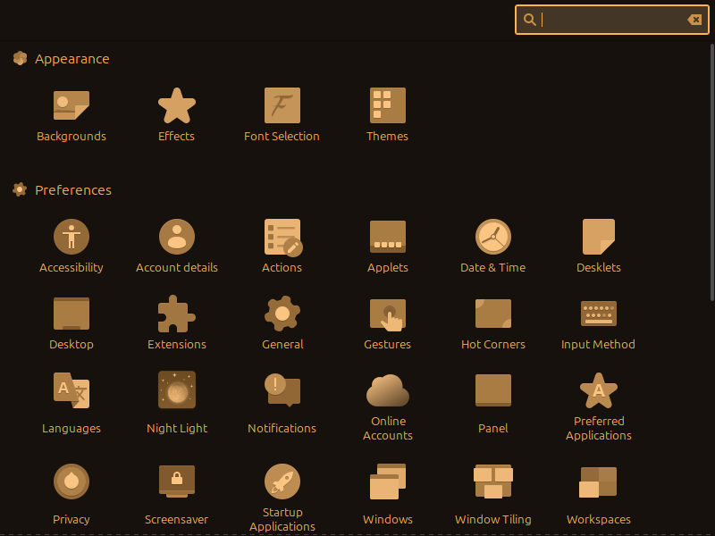
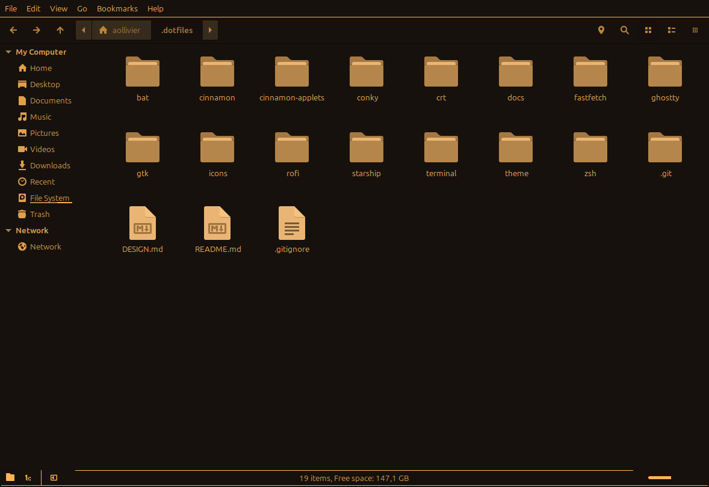
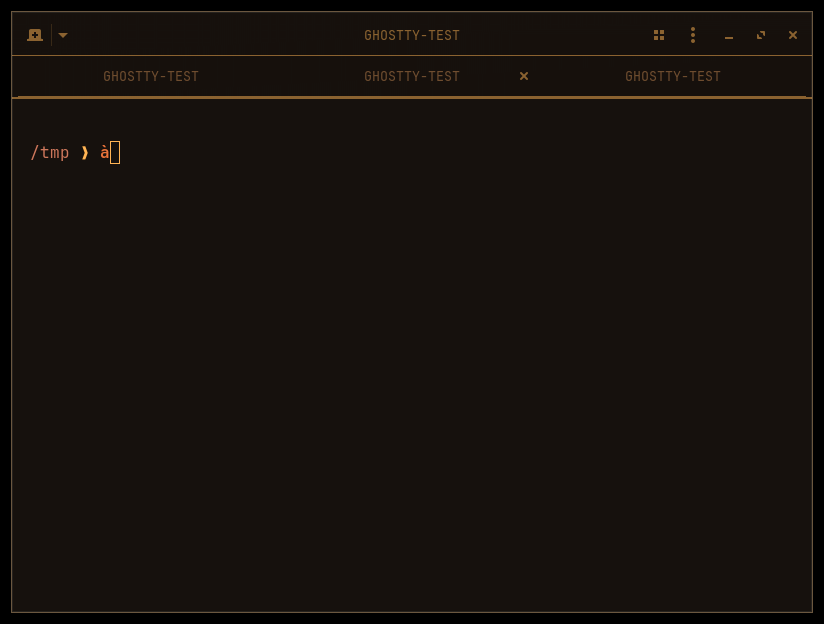
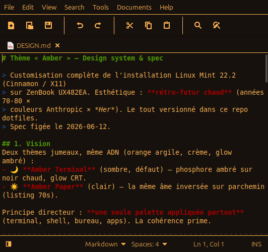

<p align="center"></p>

<p align="center">A warm, retro-futurist <b>amber</b> theme for <b>Linux Mint Cinnamon (X11)</b><br>— amber phosphor on warm black, one palette everywhere: terminal, shell, desktop, and apps.</p>

<p align="center"><a href="LICENSE"></a> </p>

## Gallery

|  |  |
|---|---|
|  |  |
|  |  |

## What's themed

- **Terminal & shell** — Ghostty (theme + halo/CRT shaders), zsh + Starship, eza/bat/fd/zoxide/fzf/fastfetch, JetBrainsMono Nerd Font.
- **Cinnamon desktop** — `Amber` theme (Mint-Y-Dark fork): a single flat `#16110D` background, amber text/borders/menus/tabs, panel applets (statusline + CRT toggle), multi-monitor conky HUD, rofi launcher.
- **Icons** — `Amber-Icons`: a full monochrome-amber set (Papirus recolored via a single-hue ramp, relief preserved).
- **Consistent** — context menus, applet popups, GTK apps, cinnamon-settings, and GTK4/libadwaita windows all share the palette.

## Install

Requires `stow`, `papirus-icon-theme`, the `Mint-Y-Dark-Sand` base theme, and JetBrainsMono Nerd Font.

```sh
git clone git@github.com:Axel-Ollivier/amber-os.git ~/.dotfiles
cd ~/.dotfiles

# 1. dotfiles — symlinks into $HOME via GNU stow
stow ghostty zsh starship bat fastfetch conky rofi gtk cinnamon-applets

# 2. Cinnamon/GTK theme (generated)
theme/build-amber-theme.sh

# 3. monochrome amber icons (generated)
icons/build-amber-icons.sh

# 4. activate
gsettings set org.cinnamon.theme name 'Amber'
gsettings set org.cinnamon.desktop.interface gtk-theme 'Amber'
gsettings set org.cinnamon.desktop.wm.preferences theme 'Amber'
gsettings set org.cinnamon.desktop.interface icon-theme 'Amber-Icons'
```

## How it works

The theme and icons are **generated** (not committed) and the builds are idempotent — they fork upstream Mint-Y-Dark-Sand / Papirus on every run:

- **`theme/warmize.py`** maps every neutral/cold gray to a warm amber step of equivalent luminance, preserving brand colors and light text.
- **`icons/icon-amberize.py`** recolors every SVG to a single-hue amber ramp, keeping each icon's relief.

## Structure

| Path | Contents |
|------|----------|
| `theme/`, `icons/` | Theme and icon generators |
| `ghostty/`, `zsh/`, `conky/`, `rofi/`, `gtk/`, … | Stow packages (mirror `$HOME`) |
| `cinnamon/` | Cinnamon config snapshot/rollback tools |

Each package mirrors `$HOME` (e.g. `ghostty/.config/ghostty/config` → `~/.config/ghostty/config`).

## License

[MIT](LICENSE)
